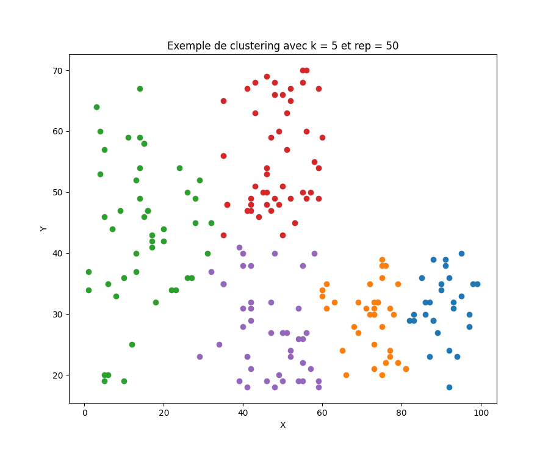

# ALGORITHME DE LA K-MOYENNE

## Résumé du programme et utilisation

Ce programme Python implémente l'algorithme de la K-moyenne.
Pour l'utiliser, vous devez faire appel à la fonction `def kmeans` dont la signature est :

```def kmeans(k, points, repetition):```

Détails des paramètres
- `k` (entier) : le nombre de clusters
- `points` : les données d'entrées, en dimension quelconque
- `repetition` : le nombre de recalcul du centroïde que l'on souhaite effectuer

## Exemple d'application

Ci-contre un cas d'utilisation de l'algorithme. Les données étaient à deux dimensions pour permettre une visualisation facile.



**Lien de la base de données utilisée :**
https://www.kaggle.com/datasets/vjchoudhary7/customer-segmentation-tutorial-in-python

*(Colonnes utilisées : `Spending Score (1-100)` et `Age`)*